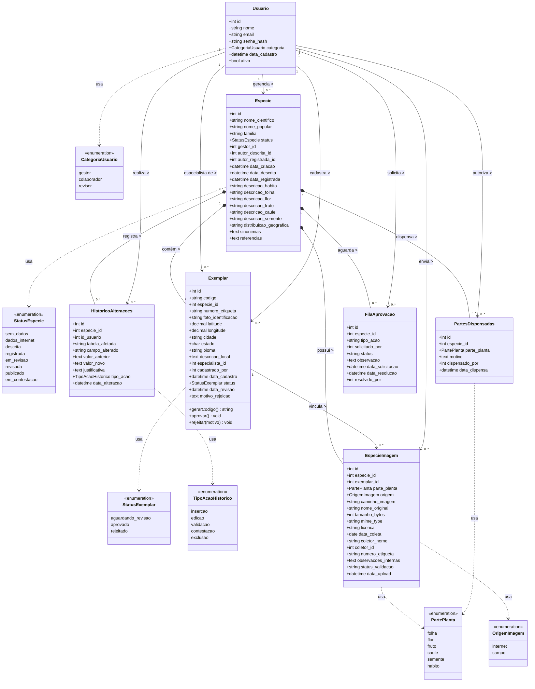

# Diagrama de Classes — Penomato

> **Como visualizar:** Cole o bloco abaixo em [https://mermaid.live](https://mermaid.live) para exportar como PNG ou SVG,
> ou instale a extensão **"Markdown Preview Mermaid Support"** no VS Code para ver direto no editor.

---

---

## Legenda dos relacionamentos

| Notação | Significado |
|---|---|
| `*--` (composição) | A entidade filha não existe sem a pai — ex: Exemplar não existe sem Espécie |
| `-->` (associação) | Referência entre entidades independentes — ex: Usuario referenciado como especialista |
| `..>` (dependência) | Classe usa a enumeração como tipo de atributo |
| `"1"` e `"0..*"` | Multiplicidades: um para zero ou muitos |

---

## Descrição das classes

### Usuario
Representa qualquer pessoa cadastrada no sistema. O papel (`categoria`) determina o que o usuário pode fazer: o **gestor** cadastra espécies e autoriza dispensas de partes; o **colaborador** insere dados morfológicos e fotografias; o **revisor/especialista** aprova exemplares e artigos.

### Especie
Entidade central do sistema. Representa uma espécie vegetal de interesse científico. Concentra os atributos fitomorfológicos descritivos (hábito, folha, flor, fruto, caule, semente) e controla o status de progresso ao longo do fluxo de documentação.

### Exemplar
Representa um indivíduo físico específico da espécie, localizado no campo. É identificado por um código único gerado automaticamente (ex: KT001) e por uma etiqueta de alumínio pregada na planta. Precisa ser aprovado pelo especialista antes que qualquer fotografia de parte seja aceita pelo sistema.

### EspecieImagem
Registra cada fotografia enviada ao sistema, tanto de referência (origem internet) quanto de campo (origem campo, vinculada a exemplar aprovado). Armazena metadados completos de coleta: coletor, data, etiqueta, parte fotografada e licença de uso.

### PartesDispensadas
Registra formalmente as partes da planta que não estão disponíveis para fotografia (ex: espécie sem frutos na época da coleta). A dispensa é autorizada pelo gestor e computa para a verificação de completude do exemplar.

### HistoricoAlteracoes
Tabela de auditoria completa. Registra toda alteração relevante feita no sistema: inserção de dados, validações, contestações. Garante rastreabilidade total de quem fez o quê e quando.

### FilaAprovacao
Controla ações que precisam de aprovação formal — como a contestação de uma identificação ou a solicitação de geração de artigo. Permite que especialistas e gestores resolvam pendências em sua própria janela de tempo.

---

## Regras de negócio refletidas no modelo

1. `Exemplar.status` deve ser `aprovado` para que `EspecieImagem` possa ser vinculada via `exemplar_id`
2. `Especie.status = 'descrita'` exige que todos os atributos morfológicos estejam confirmados
3. `Especie.status = 'registrada'` exige que todas as `PartePlanta` estejam em `EspecieImagem` (origem campo) ou em `PartesDispensadas`, para aquela espécie
4. A geração do artigo exige `data_descrita IS NOT NULL` **e** `data_registrada IS NOT NULL` em `Especie`
5. `HistoricoAlteracoes` é populado automaticamente por todas as operações de escrita — nunca pelo usuário diretamente
