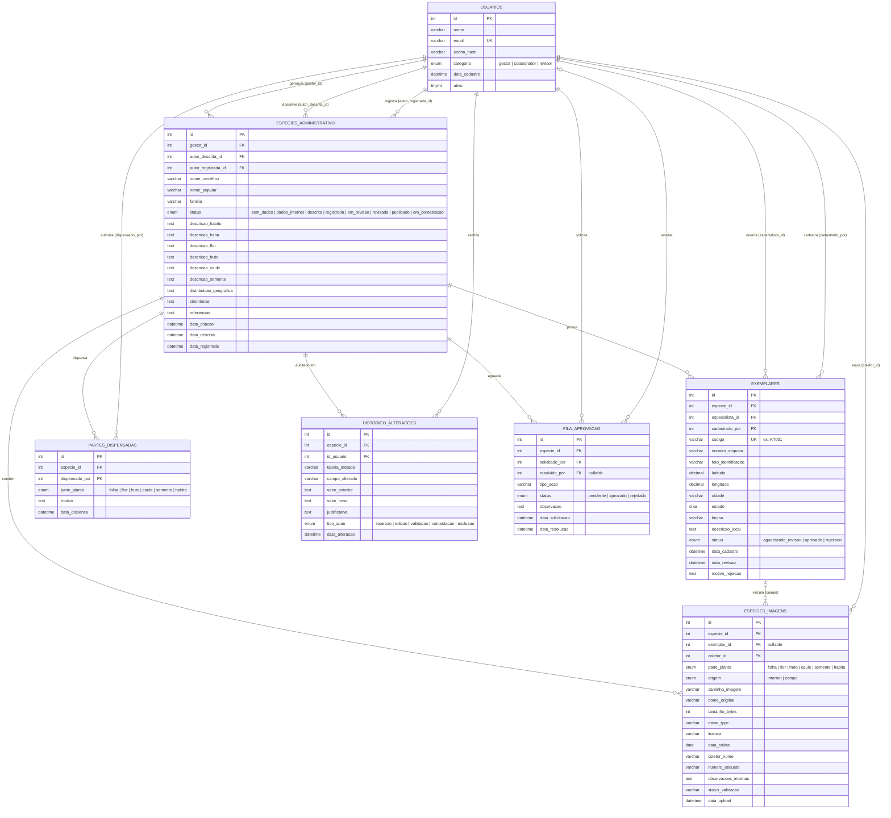

# Diagrama Entidade-Relacionamento — Penomato

> **Como visualizar:** Cole o bloco abaixo em [https://mermaid.live](https://mermaid.live) para exportar como PNG ou SVG,
> ou instale a extensão **"Markdown Preview Mermaid Support"** no VS Code para ver direto no editor.

---

---

## Legenda de cardinalidade

| Notação Mermaid | Leitura |
|---|---|
| `\|\|` | Exatamente um (obrigatório) |
| `\|o` | Zero ou um (opcional) |
| `o{` | Zero ou muitos |
| `\|{` | Um ou muitos |

---

## Dicionário de dados

### USUARIOS
Centraliza todos os usuários do sistema. O campo `categoria` define o papel e as permissões: o **gestor** coordena as demandas; o **colaborador** produz dados e fotografias; o **revisor** valida exemplares e artigos.

### ESPECIES_ADMINISTRATIVO
Entidade central. Representa uma espécie vegetal de interesse. Contém os atributos fitomorfológicos descritivos por parte da planta e controla o ciclo de vida da documentação pelo campo `status`. Os campos `data_descrita` e `data_registrada` funcionam como marcos: apenas quando ambos estão preenchidos o artigo pode ser gerado.

### EXEMPLARES
Representa um indivíduo físico de campo. Identificado por código único alfanumérico gerado automaticamente (ex: `KT001`) e por etiqueta de alumínio pregada na planta. Precisa ser aprovado pelo especialista (`status = 'aprovado'`) antes de receber fotos de partes. O georeferenciamento (latitude/longitude) é metadado científico de localidade de coleta.

### ESPECIES_IMAGENS
Armazena toda fotografia do sistema, tanto de referência internet quanto de campo. A coluna `exemplar_id` é **nullable**: é nula para imagens de internet, e obrigatoriamente preenchida para imagens de campo (`origem = 'campo'`). Garante que cada foto de campo esteja vinculada a um indivíduo físico aprovado.

### PARTES_DISPENSADAS
Registra formalmente as partes vegetais indisponíveis para fotografia (ex: espécie sem flores fora da época de floração). A dispensa é autorizada pelo gestor e é computada junto com as fotos na verificação de completude — quando todas as partes estão fotografadas **ou** dispensadas, a espécie avança para `registrada`.

### HISTORICO_ALTERACOES
Tabela de auditoria. Toda operação de escrita relevante no sistema gera um registro aqui — sem exceção. Garante rastreabilidade completa: quem inseriu, quem corrigiu, quem validou, quem contestou, e quando.

### FILA_APROVACAO
Gerencia ações que precisam de aprovação assíncrona, como contestações de identificação. Permite que especialistas e gestores resolvam pendências em sua própria janela de tempo, sem bloquear o fluxo de outros colaboradores.

---

## Regras de integridade refletidas no modelo

| Regra | Onde está no modelo |
|---|---|
| Foto de campo exige exemplar aprovado | `ESPECIES_IMAGENS.exemplar_id FK → EXEMPLARES.id` + validação no controller |
| Espécie "descrita" exige 100% dos atributos confirmados | `ESPECIES_ADMINISTRATIVO.data_descrita` só é preenchida quando confirmação é completa |
| Espécie "registrada" exige todas as partes cobertas | Verificação via JOIN entre `ESPECIES_IMAGENS` e `PARTES_DISPENSADAS` |
| Artigo só é gerado com ambas as condições | `data_descrita IS NOT NULL AND data_registrada IS NOT NULL` |
| Exemplar deletado não destrói as fotos | `ESPECIES_IMAGENS.exemplar_id ON DELETE SET NULL` |
| Espécie deletada destrói seus exemplares | `EXEMPLARES.especie_id ON DELETE CASCADE` |
