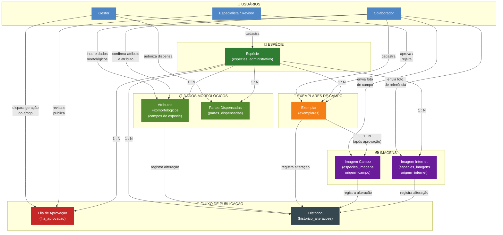
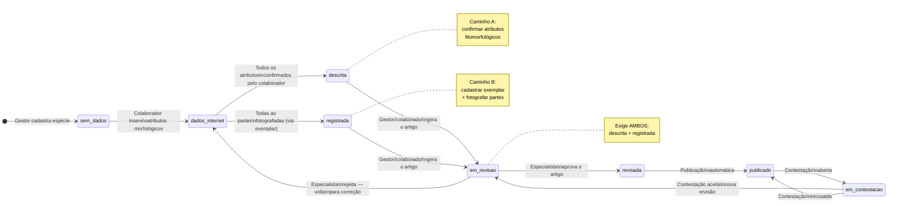
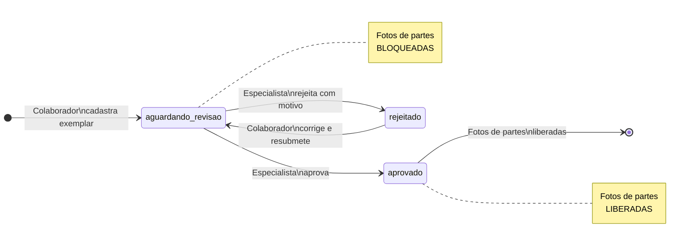
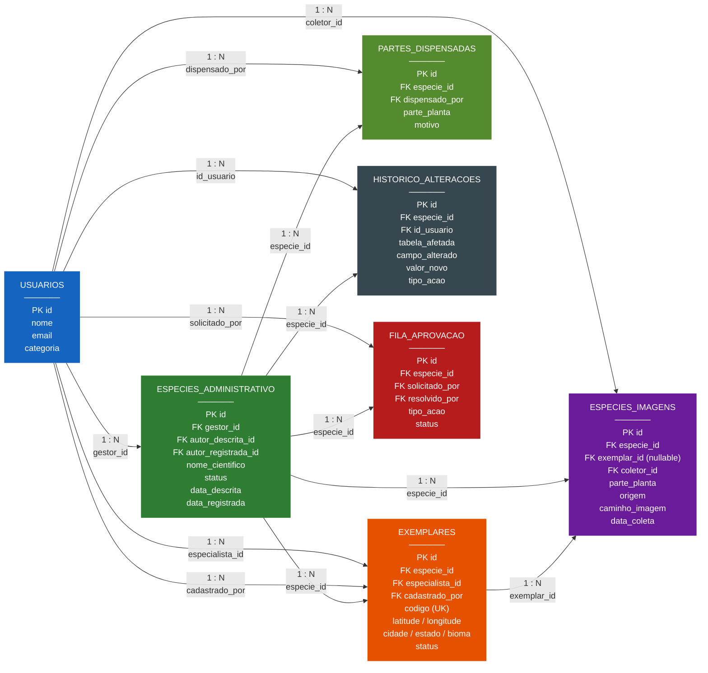

# Diagrama de Relacionamentos — Penomato

> **Como visualizar:** Cole o bloco abaixo em [https://mermaid.live](https://mermaid.live) para exportar como PNG ou SVG,
> ou instale a extensão **"Markdown Preview Mermaid Support"** no VS Code para ver direto no editor.

---

## Visão geral do sistema

---

## Fluxo de estados da espécie

---

## Fluxo de estados do exemplar

---

## Relacionamento entre tabelas (modelo relacional simplificado)

---

## Resumo das cardinalidades

| Tabela origem | Tabela destino | Cardinalidade | Coluna FK |
|---|---|---|---|
| USUARIOS | ESPECIES_ADMINISTRATIVO | 1 : N | gestor_id |
| USUARIOS | ESPECIES_ADMINISTRATIVO | 1 : N | autor_descrita_id |
| USUARIOS | ESPECIES_ADMINISTRATIVO | 1 : N | autor_registrada_id |
| USUARIOS | EXEMPLARES | 1 : N | especialista_id |
| USUARIOS | EXEMPLARES | 1 : N | cadastrado_por |
| USUARIOS | ESPECIES_IMAGENS | 1 : N | coletor_id |
| USUARIOS | PARTES_DISPENSADAS | 1 : N | dispensado_por |
| USUARIOS | HISTORICO_ALTERACOES | 1 : N | id_usuario |
| USUARIOS | FILA_APROVACAO | 1 : N | solicitado_por |
| ESPECIES_ADMINISTRATIVO | EXEMPLARES | 1 : N | especie_id |
| ESPECIES_ADMINISTRATIVO | ESPECIES_IMAGENS | 1 : N | especie_id |
| ESPECIES_ADMINISTRATIVO | PARTES_DISPENSADAS | 1 : N | especie_id |
| ESPECIES_ADMINISTRATIVO | HISTORICO_ALTERACOES | 1 : N | especie_id |
| ESPECIES_ADMINISTRATIVO | FILA_APROVACAO | 1 : N | especie_id |
| EXEMPLARES | ESPECIES_IMAGENS | 1 : N (nullable) | exemplar_id |
